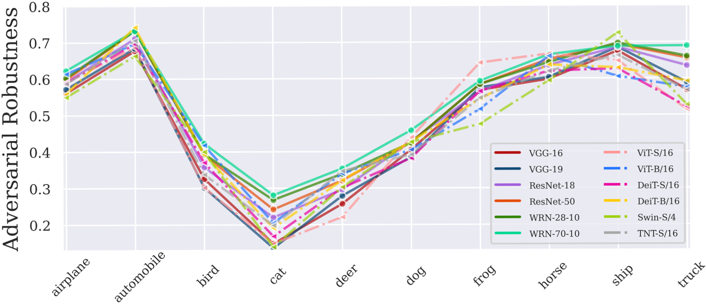
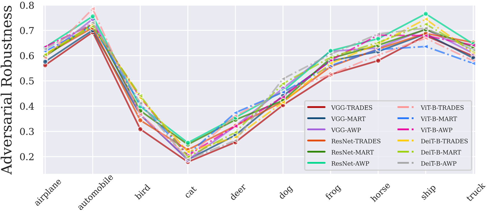
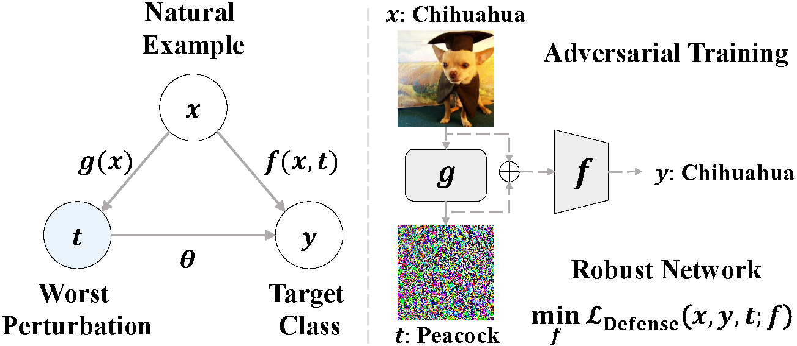
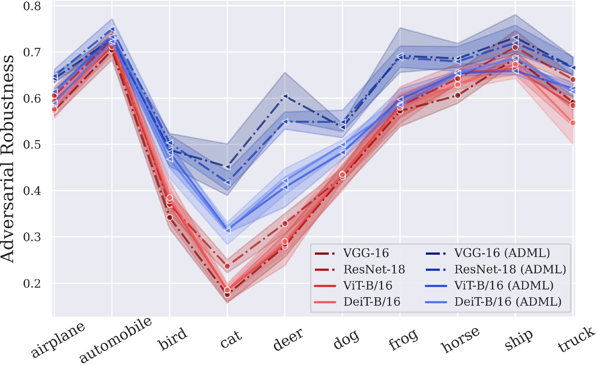

# ICCV 2023

[](https://pytorch.org/)
[](https://github.com/ByungKwanLee/Double-Debiased-Adversary/blob/master/LICENSE) 

# Title: [Mitigating Adversarial Vulnerability through Causal Parameter Estimation by Adversarial Double Machine Learning](https://openaccess.thecvf.com/content/ICCV2023/papers/Lee_Mitigating_Adversarial_Vulnerability_through_Causal_Parameter_Estimation_by_Adversarial_Double_ICCV_2023_paper.pdf)

#### Authors: [Byung-Kwan Lee*](https://scholar.google.co.kr/citations?user=rl0JXCQAAAAJ&hl=en), [Junho Kim*](https://scholar.google.com/citations?user=ZxE16ZUAAAAJ&hl=en), and [Yong Man Ro](https://scholar.google.co.kr/citations?user=IPzfF7cAAAAJ&hl=en) (*: equally contributed)
#### Affiliation: School of Electrical Engineering, Korea Advanced Institute of Science and Technology (KAIST)
#### Email: `leebk@kaist.ac.kr`, `arkimjh@kaist.ac.kr`, `ymro@kaist.ac.kr`


---

This is an Official PyTorch Implementation code for developing
adversarial double machine learning (ADML) which addresses class discrepancies and overfitting to non-vulnerable samples by utilizing the state-of-the-art causal approach relieving bias and overfitting on model, namely double machine learning (DML).
This code is combined with below state-of-the-art technologies for
accelerating adversarial attacks and defenses with Deep Neural Networks
on Volta GPU architecture.

- [x] Distributed Data Parallel [[link]](https://pytorch.org/tutorials/intermediate/ddp_tutorial.html)
- [x] Channel Last Memory Format [[link]](https://pytorch.org/tutorials/intermediate/memory_format_tutorial.html#:~:text=Channels%20last%20memory%20format%20is,pixel%2Dper%2Dpixel)
- [x] Mixed Precision Training [[link]](https://openreview.net/forum?id=r1gs9JgRZ)
- [x] Mixed Precision + Adversarial Attack (based on torchattacks [[link]](https://github.com/Harry24k/adversarial-attacks-pytorch))
- [x] Faster Adversarial Training for Large Dataset [[link]](https://openreview.net/forum?id=BJx040EFvH)
- [x] Fast Forward Computer Vision (FFCV) [[link]](https://github.com/libffcv/ffcv)


### Trouble Shooting

> In light of our computationally efficient environment settings (e.g., distributed-data-parallel (DDP), mixed precision (both float32 and float16), the format conversion of the ffcv dataset (.beton), and computation procedure from torch-version), it has been observed that altering or removing part of these components could potentially result in fluctuating the performances. Therefore, we are actively working on enhancing and refining these technical elements to address these engineering issues and further optimize our computational environment, ensuring optimal performance for our tasks and applications at the forefront of cutting-edge technologies.

---


   Adversarial examples derived from deliberately crafted perturbations on visual inputs can easily harm decision process of deep neural networks. To prevent potential threats, various adversarial training-based defense methods have grown rapidly and become a de facto standard approach for robustness. Despite recent competitive achievements, we observe that adversarial vulnerability varies across targets and certain vulnerabilities remain prevalent. Intriguingly, such peculiar phenomenon cannot be relieved even with deeper architectures and advanced defense methods described in the following figures.


<p align="center">

</p>

<p align="center">

</p>

To address this issue, in this paper, we introduce a causal approach called Adversarial Double Machine Learning (ADML), which allows us to quantify the degree of adversarial vulnerability for network predictions and capture the effect of treatments on outcome of interests. Note that, this degree is denoted by *theta* in the figure below. 

<p align="center">

</p>


ADML can directly estimate the causal parameter (*theta*) of adversarial perturbations per se and mitigate negative effects that can potentially damage robustness, bridging a causal perspective into the adversarial vulnerability.


<p align="center">

</p>


With not only the above figure, but also extensive experiments on various CNN and Transformer architectures, we corroborate that ADML improves adversarial robustness with large margins and relieve the empirical observation. For more detail, you can find a lot of empirical results in our paper on ICCV 2023.


## Our Framework (Top-Level File Directory Layout) 
    .
    ├── attack
    │   ├── fastattack.py               # Adversarial Attack Loader
    │   └── libfastattack               # Adversarial Attack Library
    │
    ├── utils
    │   ├── fast_data_utils.py          # FFCV DataLoader
    │   ├── fast_network_utils.py       # Network Loader
    │   ├── scheduler.py                # Transformer Scheduler
    │   └── utils.py                    # Numerous Utility Tools
    │
    ├── models               
    │   ├── vgg.py                      # VGG
    │   ├── resnet.py                   # ResNet
    │   ├── wide.py                     # WideResNet
    │   ├── vision_transformer.py       # ViT
    │   └── distill_transformer.py      # DeiT
    │
    ├── defense                         # AT-based Defense Methods               
    │   ├── fast_train_adv.py           # Standard Adversarial Training (AT)
    │   ├── fast_train_trades.py        # TRADES
    │   ├── fast_train_mart.py          # MART
    │   └── fast_train_awp.py           # AWP
    │
    ├── adml                            # Proposed Method               
    │   ├── fast_train_adml_adv.py      # ADML-ADV
    │   ├── fast_train_adml_trades.py   # ADML-TRADES
    │   ├── fast_train_adml_mart.py     # ADML-MART
    │   └── fast_train_adml_awp.py      # ADML-AWP
    │
    ├── fast_dataset_converter.py       # Dataset Converter for beton extension
    ├── fast_train_standard.py          # Stadnard Training
    ├── requirements.txt                # Requirement Packages
    └── README.md                       # This README File


---

## Environment Setting

#### Please check below settings to successfully run this code. If not, follow step by step during filling the checklist in.

- [ ] To utilize FFCV [[link]](https://github.com/libffcv/ffcv), you should install it on conda virtual environment.
I use python version 3.9, pytorch, torchvision, and cuda 11.3. For more different version, you can refer to PyTorch official site [[link]](https://pytorch.org/get-started/previous-versions/). 

> conda create -y -n ffcv python=3.9 cupy pkg-config compilers libjpeg-turbo opencv pytorch torchvision cudatoolkit=11.3 numba cudnn -c pytorch -c conda-forge

- [ ] Activate the created environment by conda

> conda activate ffcv

- [ ] To install FFCV, you should download it in pip and install torchattacks [[link]](https://github.com/Harry24k/adversarial-attacks-pytorch) to run adversarial attack.

> pip install ffcv torchattacks

- [ ] To guarantee the execution of this code, please additionally install library in requirements.txt (matplotlib, tqdm)

> pip install -r requirements.txt
- [ ] To address biased GPU allocation problem, download ffcv 1.0.0 or 0.4.0 version and copy and paste all files in ffcv folder of the downloaded to the path **(Necessary!)**
> paste on this path: /home/$username/anaconda3/envs/$env_name(ex:ffcv)/lib/$python_version/site-packages/ffcv
---


### How to run

#### After making completion of environment settings, then you can follow how to run below.


* First, run `fast_dataset_converter.py` to generate dataset with `.betson` extension, instead of using original dataset [[FFCV]](https://github.com/libffcv/ffcv).

```python
# Future import build
from __future__ import print_function

# Import built-in module
import os
import argparse

# fetch args
parser = argparse.ArgumentParser()

# parameter
parser.add_argument('--dataset', default='cifar10', type=str)
parser.add_argument('--gpu', default='0', type=str)
args = parser.parse_args()

# GPU configurations
os.environ["CUDA_VISIBLE_DEVICES"]=args.gpu

# init fast dataloader
from utils.fast_data_utils import save_data_for_beton
save_data_for_beton(dataset=args.dataset)
```

* Second, run `fast_train_standard.py`(Standard Training) or `fast_train_adv.py` (Standard Adversarial Training)

---

### Test Robustness

- run `fast_test_robustness.py`
---


### Available Datasets
> Refer to '***utils/fast_data_utils.py***' and '***utils/fast_network_utils.py***'
* [`CIFAR-10`](https://www.cs.toronto.edu/~kriz/cifar.html)
* [`CIFAR-100`](https://www.cs.toronto.edu/~kriz/cifar.html)
* [`Tiny-ImageNet`](https://www.kaggle.com/c/tiny-imagenet/overview)
* [`ImageNet`](https://www.image-net.org/)

---

### Available Baseline Networks

* [`VGG`](https://arxiv.org/abs/1409.1556) (*models/vgg.py*)
* [`ResNet`](https://arxiv.org/abs/1512.03385) (*models/resnet.py*)
* [`WideResNet`](https://arxiv.org/abs/1605.07146) (*models/wide.py*)
* [`ViT`](https://arxiv.org/abs/2010.11929) (*models/vision_transformer.py*)
* [`DeiT`](https://arxiv.org/abs/2012.12877) (*models/distill_transformer.py*)
---

### Available Adversarial Attacks (implemented with [Mixed-Precision](https://openreview.net/forum?id=r1gs9JgRZ) + [Torchattacks](https://github.com/Harry24k/adversarial-attacks-pytorch))

* [`FGSM`](https://arxiv.org/abs/1412.6572) (*attack/libfastattack/FastFGSM.py*)
* [`PGD`](https://arxiv.org/abs/1706.06083) (*attack/libfastattack/FastPGD.py*)
* [`CW`](https://arxiv.org/abs/1608.04644) (*attack/libfastattack/FastCWLinf.py*)
* [`AP`](https://arxiv.org/abs/2003.01690) (*attack/libfastattack/APGD.py*)
* [`DLR`](https://arxiv.org/abs/2003.01690) (*attack/libfastattack/APGD.py*)
* [`AA`](https://arxiv.org/abs/2003.01690) (*attack/libfastattack/AutoAttack.py*)


---

### Available Adversarial Defenses
> If you would like to run the code in 'defense' folder, then you should first move the codes out of the folder and run it because of the system path error.

* [`AT`](https://arxiv.org/abs/1706.06083) (*fast_train_adv.py*)
* [`TRADES`](https://arxiv.org/abs/1901.08573) (*fast_train_trades.py*)
* [`MART`](https://openreview.net/forum?id=rklOg6EFwS) (*fast_train_mart.py*)
* [`AWP`](https://arxiv.org/abs/2004.05884) (*fast_train_awp.py*)

---

### Available Proposed Methods
> If you would like to run the code in 'adml' folder, then you should first move the codes out of the folder and run it because of the system path error.

* **`ADML-ADV`** (*adml/fast_train_adml_adv.py*)
* **`ADML-TRADES`** (*adml/fast_train_adml_trades.py*)
* **`ADML-MART`** (*adml/fast_train_adml_mart.py*)
* **`ADML-AWP`** (*adml/fast_train_adml_awp.py*)

---

### Other Datasets
> First, download other datasets you want and convert them to ffcv format, and then you can run our codes with the same way described above!

---
